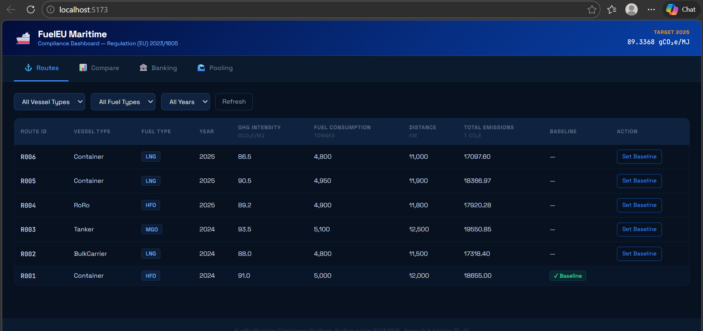
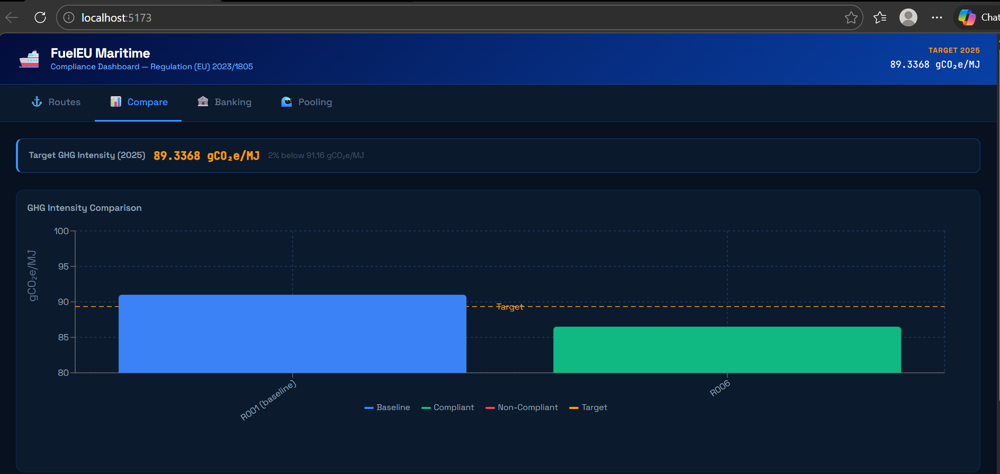
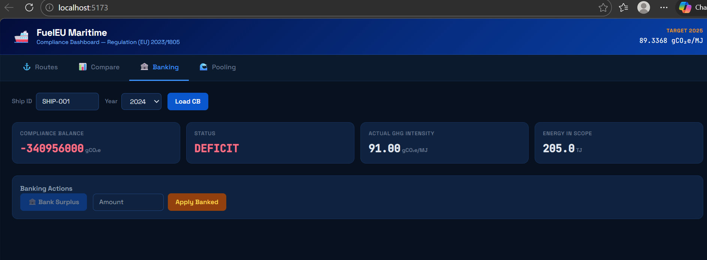
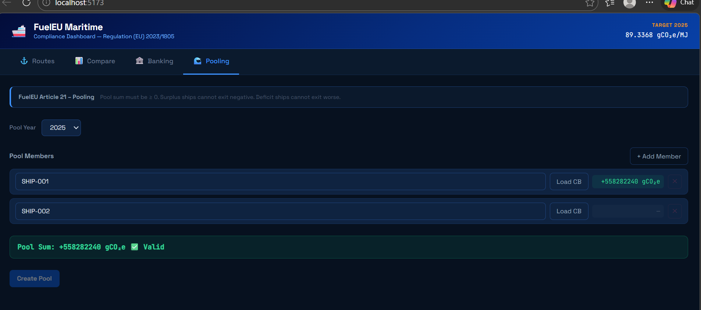
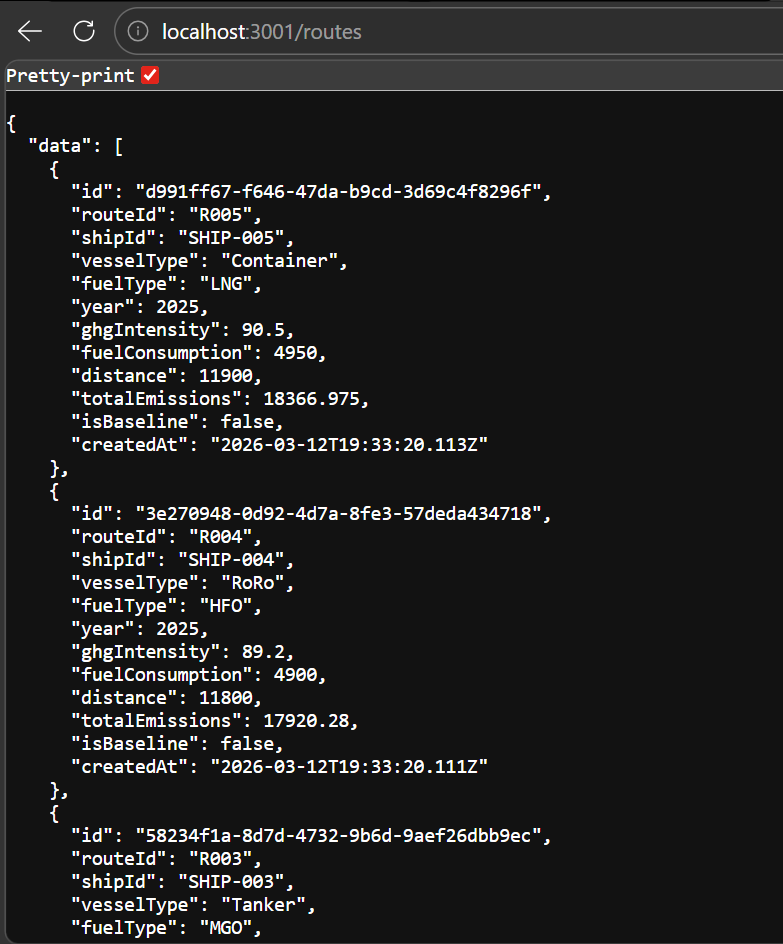
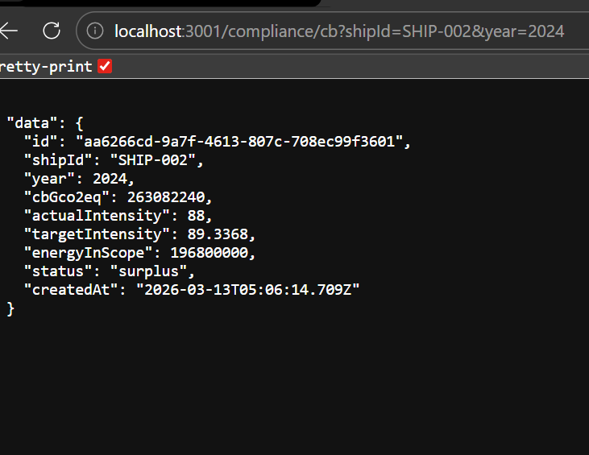
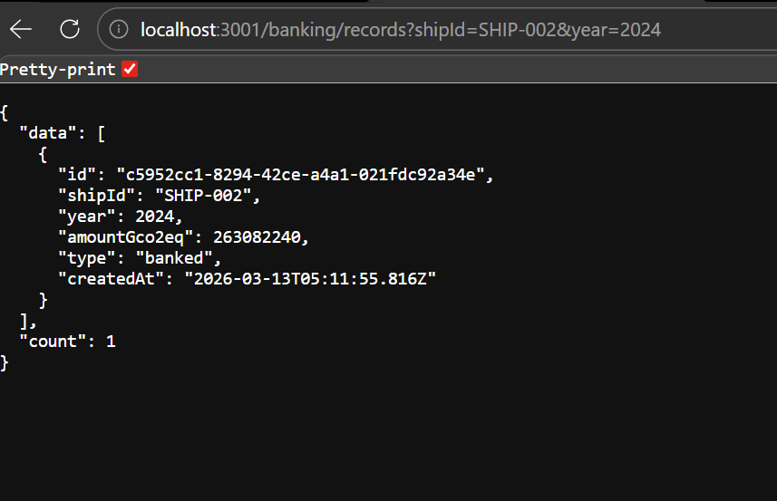
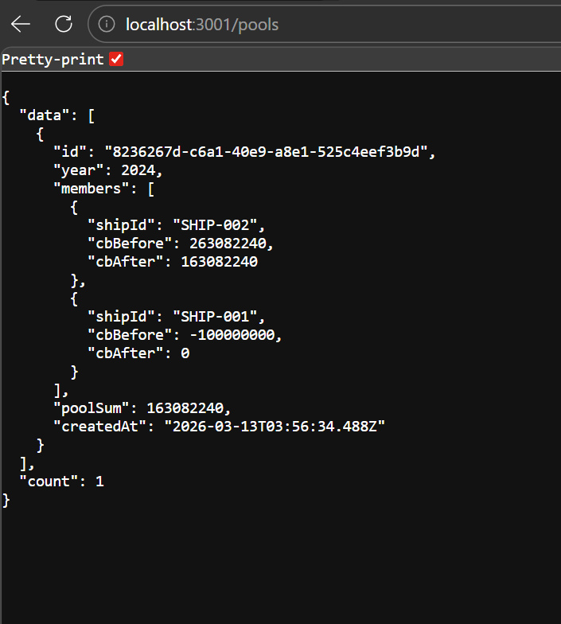

# FuelEU Maritime Compliance Platform

A full-stack compliance dashboard for **FuelEU Maritime Regulation (EU) 2023/1805**, implementing Annex IV compliance balance calculations, banking, and pooling.

---

## Architecture Overview

```
fueleu/
├── backend/          # Node.js + TypeScript + PostgreSQL (Hexagonal Architecture)
└── frontend/         # React + TypeScript + TailwindCSS (Hexagonal Architecture)
```

Both layers follow **Hexagonal (Ports & Adapters / Clean Architecture)**:

```
core/
  domain/       ← Pure domain entities and business rules (zero framework deps)
  application/  ← Use cases orchestrating domain logic
  ports/        ← Interfaces (contracts) for inbound/outbound adapters
adapters/
  inbound/      ← HTTP controllers (backend) / React components + hooks (frontend)
  outbound/     ← PostgreSQL repositories (backend) / API clients (frontend)
infrastructure/ ← Express server, DB connection, migrations, seeds
shared/
```

---

## Key Business Logic

### Compliance Balance (CB)
```
CB = (Target − Actual GHG Intensity) × Energy in Scope
Energy in Scope (MJ) = fuelConsumption (t) × 41,000 MJ/t
Target Intensity (2025) = 89.3368 gCO₂e/MJ
```
- **CB > 0** → Surplus
- **CB < 0** → Deficit

### Banking (Article 20)
- Bank positive CB (surplus) to carry forward
- Apply banked surplus to cover deficits
- Validation: cannot bank deficit; cannot over-apply

### Pooling (Article 21)
- Pool ∑(adjustedCB) ≥ 0
- Surplus ship cannot exit with negative CB
- Deficit ship cannot exit worse than entered
- Greedy allocation: sort desc by CB, transfer surplus to deficits

---

## Setup & Run

### Prerequisites
- Node.js ≥ 18
- PostgreSQL ≥ 14
- npm ≥ 9

### Backend

```bash
cd backend
cp .env.example .env
# Edit DATABASE_URL in .env

npm install
npm run db:migrate      # Run migrations
npm run db:seed         # Load seed data (5 routes from spec)
npm run dev             # Start on :3001
```

### Frontend

```bash
cd frontend
npm install
npm run dev             # Start on :5173
```

The frontend proxies `/api/*` → `http://localhost:3001` via Vite.

---

## Running Tests

### Backend
```bash
cd backend
npm test                # All tests
npm run test:unit       # Unit tests only (domain logic)
npm run test:integration # Integration tests (HTTP)
```

### Frontend
```bash
cd frontend
npm test                # Vitest unit tests
```

---

## API Endpoints

| Method | Path | Description |
|--------|------|-------------|
| GET | `/routes` | List routes (filterable by vesselType, fuelType, year) |
| POST | `/routes/:id/baseline` | Set route as baseline |
| GET | `/routes/comparison` | Baseline vs comparison with % diff |
| GET | `/compliance/cb?shipId&year` | Compute and store compliance balance |
| GET | `/compliance/adjusted-cb?shipId&year` | CB after banking |
| GET | `/banking/records?shipId&year` | Banking history |
| POST | `/banking/bank` | Bank surplus CB |
| POST | `/banking/apply` | Apply banked to deficit |
| GET | `/pools` | List pools |
| POST | `/pools` | Create pool (validates Article 21 rules) |

---

## Seed Data

| Route | Vessel | Fuel | Year | GHG (gCO₂e/MJ) |
|-------|--------|------|------|-----------------|
| R001 | Container | HFO | 2024 | 91.0 ❌ |
| R002 | BulkCarrier | LNG | 2024 | 88.0 ✅ |
| R003 | Tanker | MGO | 2024 | 93.5 ❌ |
| R004 | RoRo | HFO | 2025 | 89.2 ✅ |
| R005 | Container | LNG | 2025 | 90.5 ❌ |

---

## Screenshots

### Frontend Dashboard

#### 🚢 Routes Tab


#### 📊 Compare Tab


#### 🏦 Banking Tab



#### 🌊 Pooling Tab


---

### API Responses

#### Routes API


#### Compliance API


#### Banking API


#### Pools API

```

---


